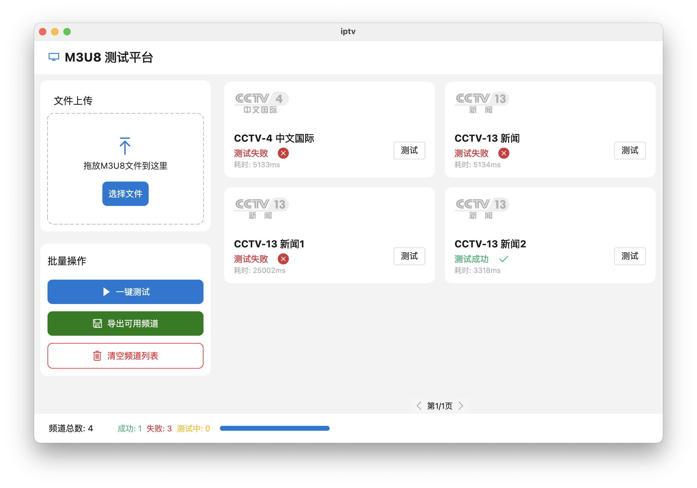

# IPTV Checker

## 项目简介

IPTV Checker 是一个用于测试和验证IPTV频道可用性的工具。它可以批量测试M3U8播放列表中的频道，并生成详细的测试报告。

## 功能特点

- 支持导入M3U8格式的播放列表
- 批量测试频道可用性
- 实时显示测试进度和结果统计
- 导出可用频道列表
- 生成测试报告

## 平台支持

- ✅ macOS (已支持)
- ⏳ Linux (即将支持)
- ⏳ Windows (即将支持)

## 安装与使用

1. 确保已安装Flutter开发环境
2. 克隆本项目
3. 运行 `flutter pub get` 安装依赖
4. 使用 `flutter run` 启动应用

## 界面说明

- **顶部工具栏**：导入M3U8文件、开始测试
- **频道列表**：显示所有频道及其测试状态
- **底部状态栏**：显示测试进度和统计信息

## 导出功能

测试完成后，可以导出所有可用频道到一个新的M3U8文件。

## 技术支持

如有问题，请联系开发者。