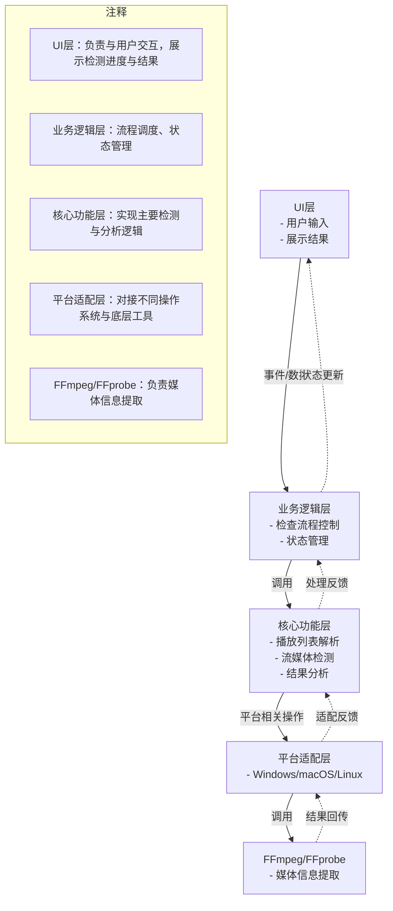
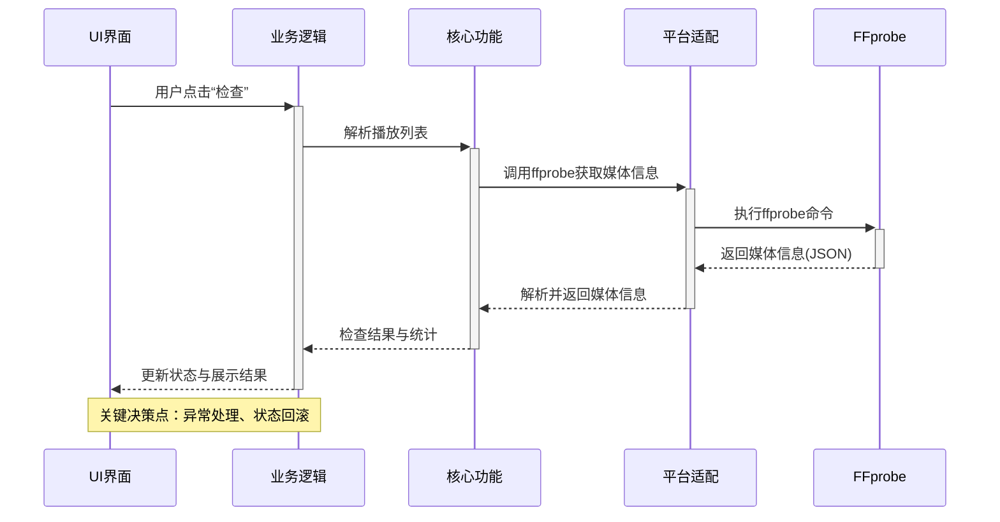

# Flutter桌面版架构设计

## 模块划分

1. **UI层**
   - 播放列表管理界面
   - 检查结果展示
   - 设置面板

2. **业务逻辑层**
   - 播放列表解析
   - 流媒体检查调度
   - 状态管理

3. **核心功能层**
   - FFprobe集成
   - HTTP请求处理
   - 错误处理

4. **平台适配层**
   - Linux/macOS/Windows特定实现
   - FFmpeg二进制分发

## 整体架构逻辑图

## 数据流

## 关键技术

- Flutter状态管理: Riverpod
- 原生交互: MethodChannel
- 跨平台存储: Hive
- UI框架: Fluent UI