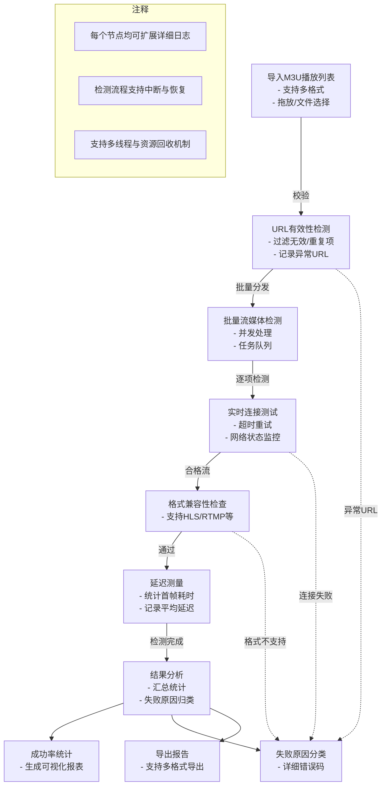

# Flutter桌面版核心功能模块

## 播放列表处理
- 支持M3U格式解析
- 自动URL有效性检测
- 批量处理能力

## 流媒体检测
- 实时连接测试
- 格式兼容性检查
- 延迟测量

## 结果分析
- 成功率统计
- 失败原因分类
- 导出报告功能

## 性能优化
- 多线程检测
- 缓存机制
- 资源回收

## 核心功能流程图

```mermaid
flowchart TD
    A[导入M3U播放列表\n- 支持多格式\n- 拖放/文件选择] -->|校验| B[URL有效性检测\n- 过滤无效/重复项\n- 记录异常URL]
    B -->|批量分发| C[批量流媒体检测\n- 并发处理\n- 任务队列]
    C -->|逐项检测| D[实时连接测试\n- 超时重试\n- 网络状态监控]
    D -->|合格流| E[格式兼容性检查\n- 支持HLS/RTMP等]
    E -->|通过| F[延迟测量\n- 统计首帧耗时\n- 记录平均延迟]
    F -->|检测完成| G[结果分析\n- 汇总统计\n- 失败原因归类]
    G --> H[成功率统计\n- 生成可视化报表]
    G --> I[失败原因分类\n- 详细错误码]
    G --> J[导出报告\n- 支持多格式导出]
    B -.->|异常URL| I
    D -.->|连接失败| I
    E -.->|格式不支持| I
    subgraph 注释
        direction LR
        note1[每个节点均可扩展详细日志]
        note2[检测流程支持中断与恢复]
        note3[支持多线程与资源回收机制]
    end
```
