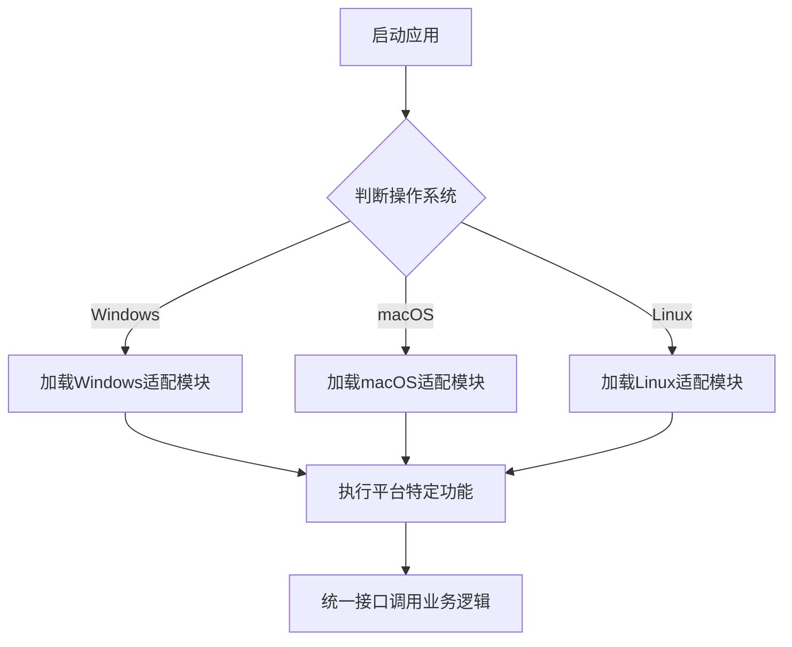

# Flutter桌面版跨平台实现指南

## 平台差异处理
1. **Windows适配**
   - 系统托盘实现
   - 窗口管理
   - 注册表访问

2. **macOS适配**
   - 菜单栏集成
   - 沙盒权限
   - 原生外观

3. **Linux适配**
   - 桌面通知
   - 系统主题
   - 包依赖管理

## 通用解决方案
```dart
// 平台判断示例
bool get isWindows => Platform.isWindows;
bool get isMacOS => Platform.isMacOS;
bool get isLinux => Platform.isLinux;

// 平台特定代码
if (isWindows) {
  // Windows特有实现
} else if (isMacOS) {
  // macOS特有实现
}
```

## 最佳实践
- 抽象平台相关代码
- 统一接口设计
- 测试矩阵覆盖

### 跨平台适配流程图

