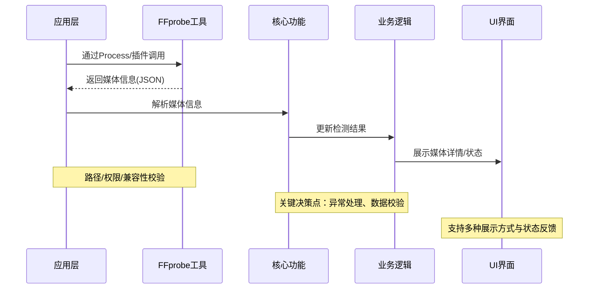

# FFprobe集成方案

## 集成方式
1. 通过Process调用本地FFprobe可执行文件
2. 使用flutter_ffmpeg插件
3. 自定义FFprobe封装

## 使用示例
```dart
// 调用FFprobe获取媒体信息
Future<Map<String, dynamic>> getMediaInfo(String filePath) async {
  final result = await Process.run('ffprobe', [
    '-v', 'error',
    '-show_format',
    '-show_streams',
    '-of', 'json',
    filePath
  ]);
  
  return jsonDecode(result.stdout);
}
```

## 常见问题
- 路径配置问题
- 跨平台兼容性
- 性能优化建议

## FFprobe 调用与数据流转流程图

