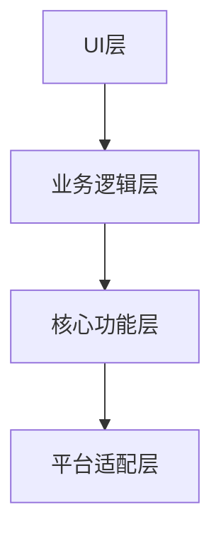

# Flutter桌面版IPTV检查工具开发指南

## 项目概述

本指南描述如何将Node.js版IPTV检查工具重构为Flutter桌面应用，支持Linux/Mac/Windows平台。

## 核心功能

1. 播放列表检查
2. 流媒体链接验证
3. 跨平台支持
4. 内置ffprobe集成

## 架构设计

## 开发环境

- Flutter 3.0+ (支持桌面)
- FFmpeg/FFprobe
- 各平台开发工具链

## 实现步骤

1. 创建Flutter桌面项目
2. 实现核心功能模块
3. 设计桌面UI
4. 集成ffprobe
5. 平台适配

## 详细实现...