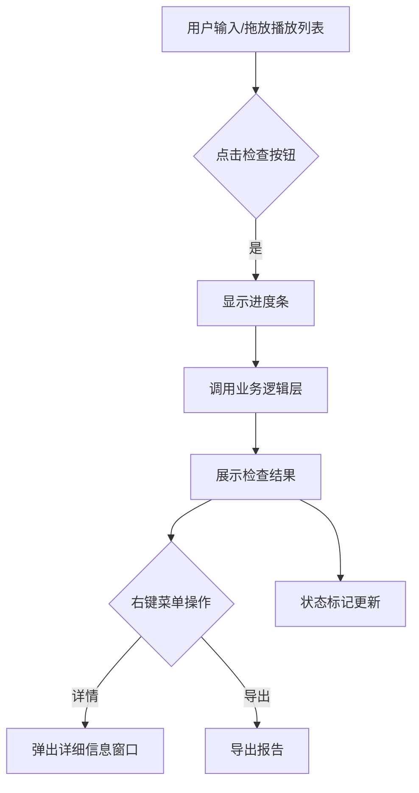

# Flutter桌面版UI设计指南

## 设计原则

1. 现代化桌面应用体验
2. 响应式布局适配不同尺寸
3. 高效的操作流程

## 核心界面

1. **主界面**
   - 播放列表输入区域
   - 检查控制按钮
   - 实时进度显示

2. **结果展示**
   - 频道列表
   - 状态标记(成功/失败)
   - 详细媒体信息

3. **设置面板**
   - 检查参数配置
   - 代理设置
   - FFprobe路径设置

## 交互设计

1. 拖放播放列表文件
2. 右键上下文菜单
3. 多窗口支持

### 主界面交互流程图



## 实现技术

- 使用Fluent UI组件库
- 响应式布局: Flex和GridView
- 状态管理: Riverpod

## 视觉规范

```dart
// 主题定义示例
final appTheme = ThemeData(
  primaryColor: Colors.blueGrey[800],
  accentColor: Colors.blueAccent,
);
```